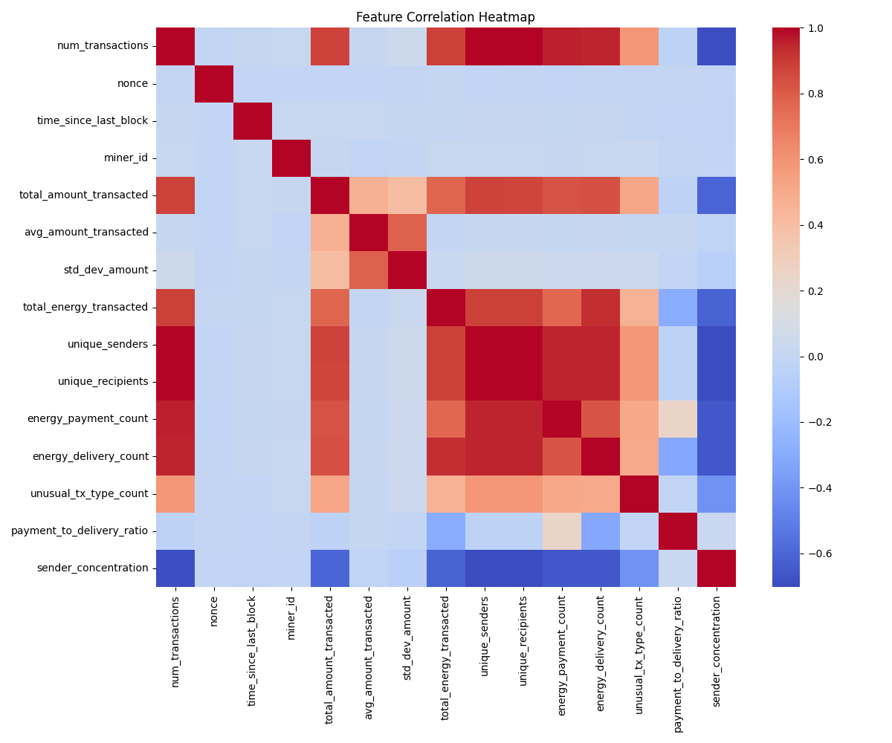
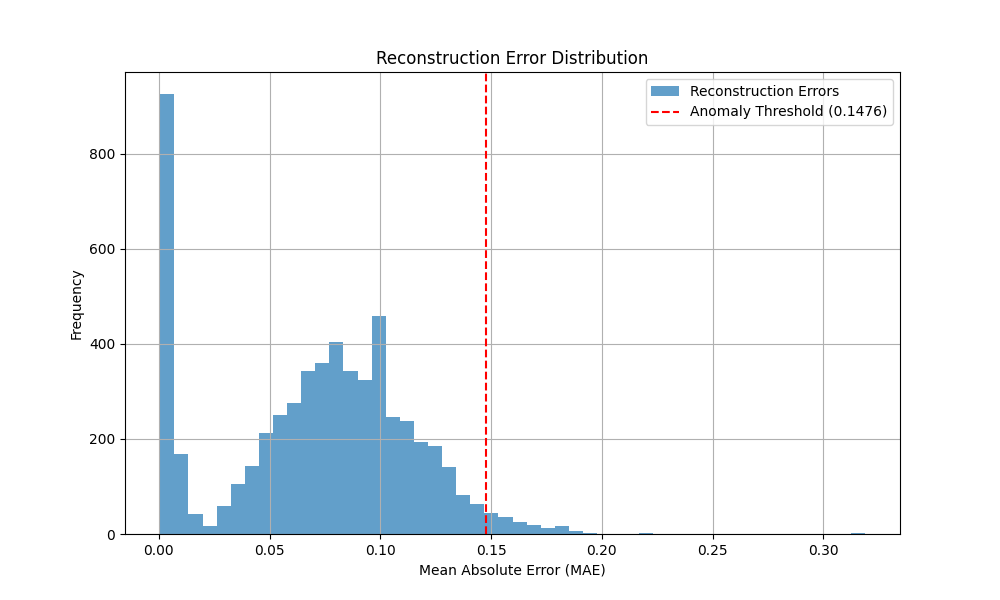

# Smart Grid Blockchain Simulation with Anomaly Detection

This project implements a blockchain-based smart grid system with integrated anomaly detection capabilities using machine learning. The system simulates grid node behavior, monitors transactions, and detects potential anomalies in real-time.

## System Overview

The system consists of multiple components that work together to simulate and monitor a blockchain-based smart grid:

- Blockchain simulation engine
- Real-time anomaly detection
- LSTM-based autoencoder for unsupervised learning
- Performance monitoring and visualization
- Data preprocessing and feature extraction pipeline

## Key Features

- Real-time transaction monitoring
- Unsupervised anomaly detection
- Performance metrics tracking
- Visualization dashboard
- Configurable simulation parameters

## Visualizations

### System Performance Analysis


*Distribution of transaction processing latencies across the network*


*Temporal analysis of miner participation and block creation*

### Anomaly Detection Insights


*Correlation analysis of blockchain features used in anomaly detection*


*Temporal evolution of critical blockchain metrics*

### Model Performance


*LSTM autoencoder reconstruction error patterns*


*Detailed analysis of reconstruction errors by feature*

## Installation

1. Clone the repository
2. Install dependencies:
```bash
pip install -r requirements.txt
```

## Usage

### Running the Simulation

```bash
./run.sh
```

### Training the Model

```bash
python train_model.py
```

### Live Detection

```bash
python fraud_detector.py
```

## Project Structure

- `models/` - Core blockchain and ML model implementations
- `utils/` - Helper functions and utilities
- `data/` - Dataset storage
- `visualized_data/` - Generated visualizations and analysis
- `notebooks/` - Jupyter notebooks for data exploration
- `saved_models/` - Trained model checkpoints

## Performance Metrics

The system's performance is continuously monitored and visualized:


*Impact of different anomaly types on system latency*

## Contributing

Contributions are welcome! Please feel free to submit pull requests.

## License

This project is licensed under the MIT License - see the LICENSE file for details.